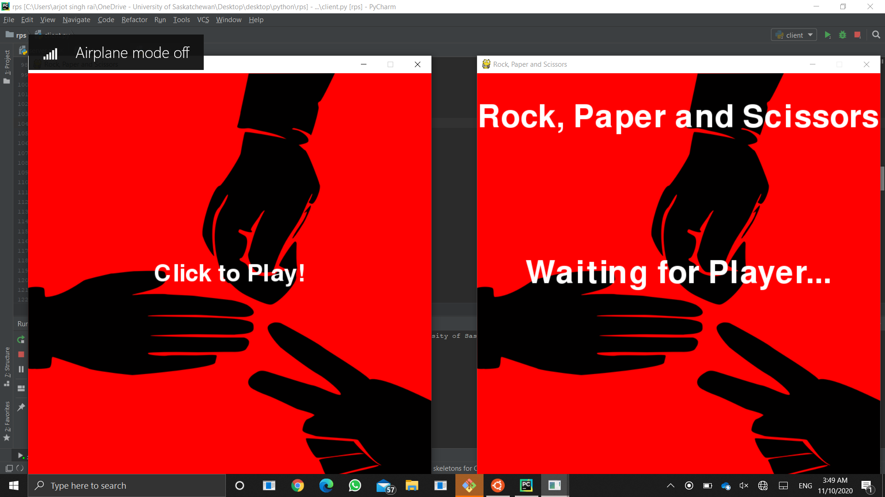
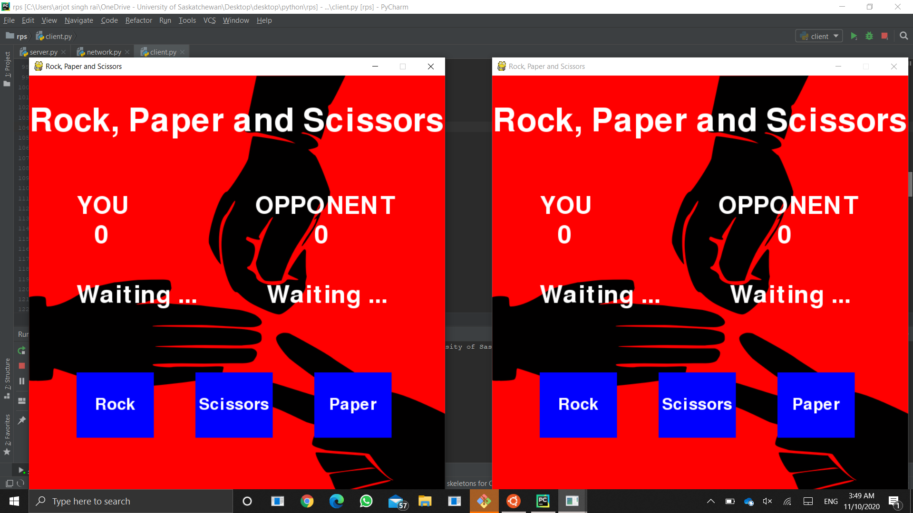
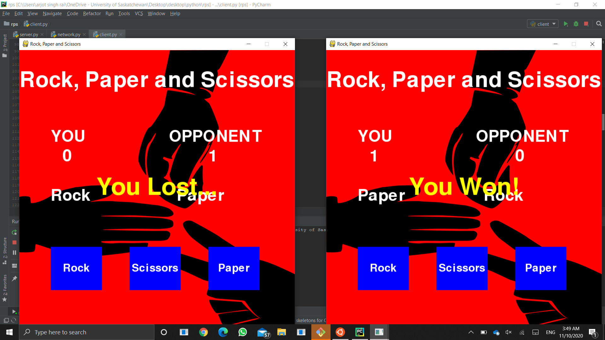

# Rock-paper-and-scissors
A game created using the Python library Pygame and socket programming. Some of the main features of this game:
- Allows multiple games to be played at once.
- Notifies a player if the opponent leaves.
- Displays the results of each game to each of the involved players.

